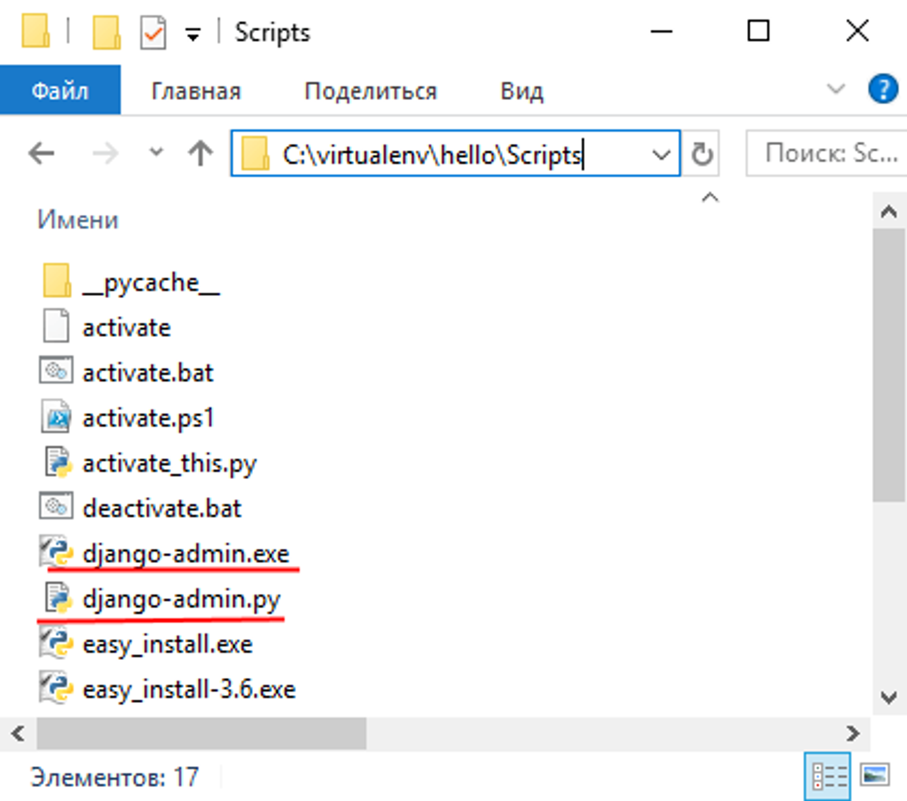
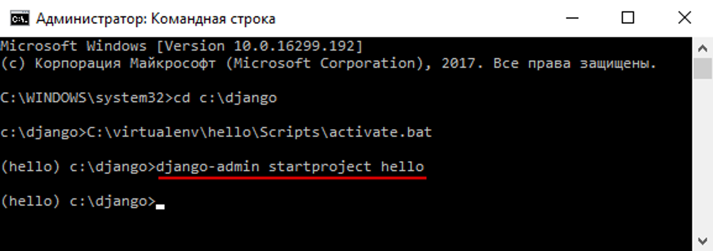
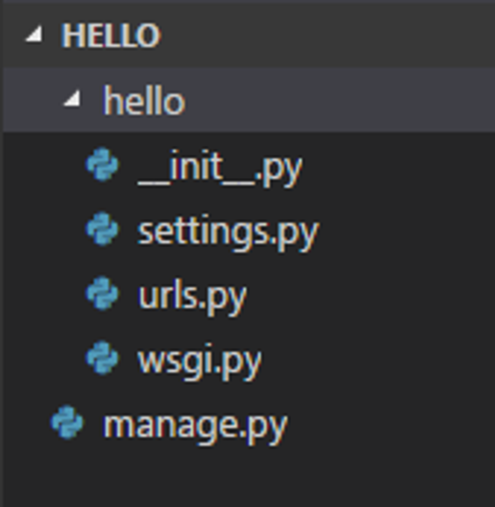
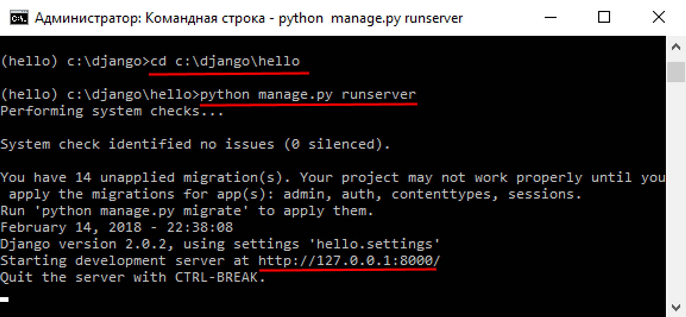
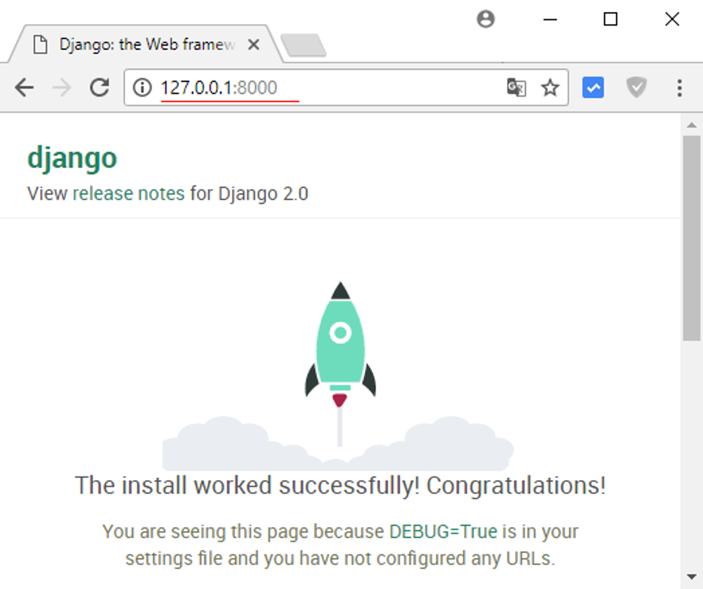

# **Введение в Django**

Django – это фреймворк для веб-приложений, основанный на Python. Django проектировался для работы под управлением Apache (с модулем mod_python) и с использованием PostgreSQL в качестве базы данных. В настоящее время, помимо PostgreSQL, Django может работать с другими СУБД.

## **Использование**

Django стоит использовать в следующих случаях:

- Если у веб-приложения будет большой бэкенд;
- Если требуется админ-панель;
- Если вы не хотите заморачиваться с безопасностью;
- Если вы хотите написать бэкенд максимально быстро.

## **Как начать работать, используя Django**

Будучи веб-фреймворком Python, Django требует Python. Последнюю версию Python можно найти на [https://www.python.org/download/](https://www.python.org/download/).
Далее требуется установить официальный релиз. Это самый лучший вариант для большинства пользователей.
Чтобы проверить что Django доступен для Python, выполните python в терминале. Теперь в консоли Python выполните импорт Django:

          **>>> import Django
          >>> print(django.get_version())**

При установке Django в папке виртуальной среды устанавливается 
скрипт django-admin.py. 
А на Windows также исполняемый файл django-admin.exe. Их можно найти в папке виртуальной среды, в которую производилась установка Django: на Windows - в подкаталоге Scripts, а на Linux/MacOS - в каталоге bin.

Django-admin предоставляет ряд команд для управления проектом Django. В частности, для создания проекта применяется команда startproject. 
Этой команде в качестве аргумента передается название проекта.
Итак, вначале активируем ранее созданную виртуальную среду (например, среду hello, которая была создана в прошлой теме, если онаранее не была активирована) и затем выполним следующую команду:**django-admin startproject hello**

В данном случае мы создаем проект hello. Имя проекта необязательно должно совпадать с именем виртуальной среды. После выполнения этой команды в текущей папке будет создан подкаталог hello.

Проект будет состоять из следующих элементов:

- manage.py: выполняет различные команды проекта, например, запускает приложение;
- hello;
- __init__.py: данный файл указывает, что папка, в которой он
находится, будет рассматриваться как модуль. Это стандартный файл для
Python. settings.py: содержит настройки конфигурации проекта;
- urls.py: содержит шаблоны URL-адресов, по сути определяет систему маршрутизации проекта;
- wsgi.py: содержит свойства конфигурации WSGI (Web Server Gateway Inerface). Он используется при развертывании проекта.

Запустим проект на выполнение. Для этого с помощью команды cd перейдем в консоли к папке проекта. И затем для запуска проекта выполнимследующую команду:**python manage.py runserver**

После запуска проекта в консоли мы увидим адрес, по которому запущен проект. Как правило, это адрес http://127.0.0.1:8000/. 
Откроем любой веб-браузер и введем данный адрес в адресную строку браузера. И нам откроется содержимое по умолчанию.

## **Плюсы и минусы**

Плюсы:

- Административная панель Django автоматически генерируется при создании приложения. Это избавляет разработчика от необходимости
создавать админку вручную;
- ORM. В Django реализовано объектно-реляционное отображение
(ORM), которое обеспечивает взаимодействие приложения с базами данных
(БД). ORM автоматически передаёт данные из БД, например, PostgreeSQL или MySQL, в объекты, которые используются в коде приложения;
- Безопасность. Django безопасен из коробки и включает
механизмы предотвращения распространенных атак вроде SQL-инъекций (XSS) и подделки межсайтовых запросов (CSRF).

Минусы:

- Проприетарность стандартных модулей. Некоторые модули Django, например, ORM или формы, сложно заменить. Разработчикам приходится
тратить много времени, чтобы изменить внутреннюю структуру фреймворка и
использовать альтернативные инструменты;
- Избыточность в небольших проектах. Возможности Django могут
быть избыточными для небольшого проекта. Однако в экосистеме Python есть другие фреймворки, которые можно использовать в таких случаях.
Например, если вы хотите сделать простой чат, лучше использовать Flask.

## **Полезные ссылки и документация**

- [https://www.djangoproject.com/](https://www.djangoproject.com/) - официальный сайт фреймворка;
- [https://djbook.ru/](https://djbook.ru/) - русскоязычный форум по Django;
- [https://stackoverflow.com/questions/tagged/django/ - вопросы и ответы по Django](https://stackoverflow.com/questions/tagged/django/);
- [https://djbook.ru/rel3.0/py-modindex.html/](https://djbook.ru/rel3.0/py-modindex.html) - модули для django на русском.