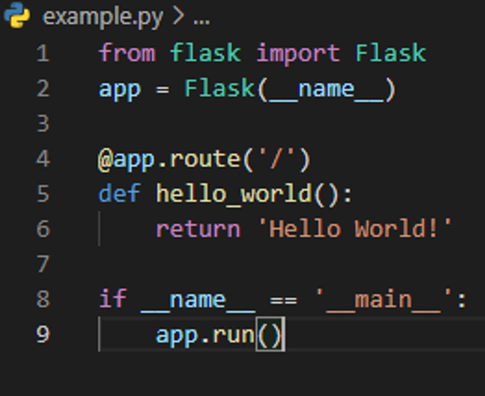
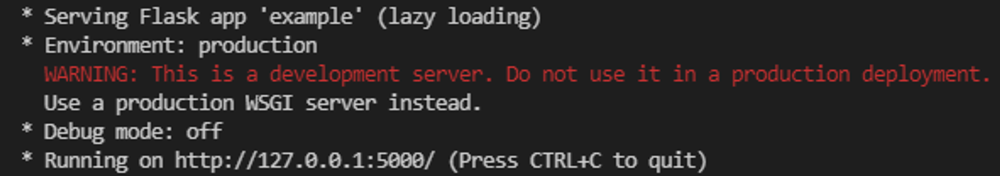
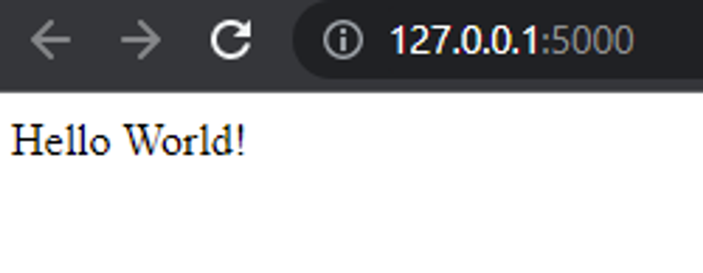
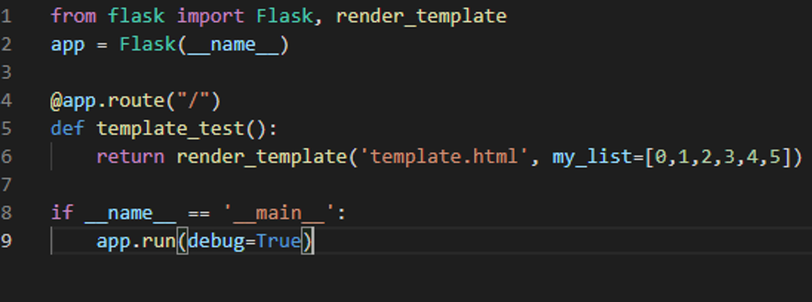
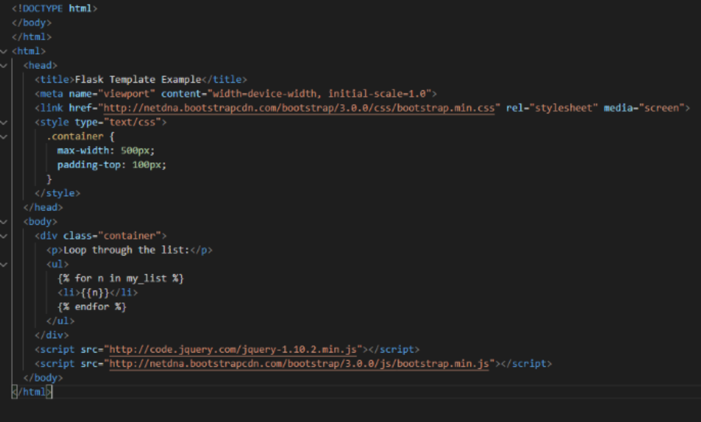
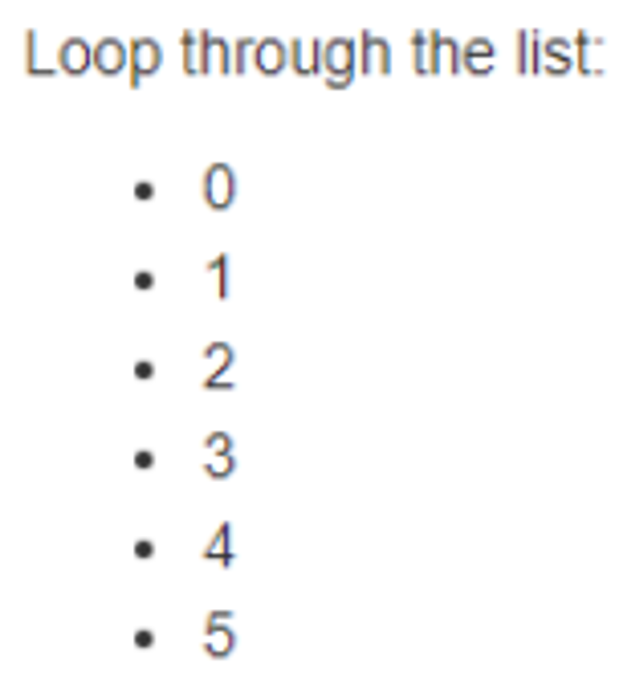

# **Введение в Flask**

Данный фреймворк предназначен для разработки веб приложений, использующих язык программирования Python. Сам же Flask использует набор инструментов Werkzeug и шаблонизатор Jinja2. Совместим же данный фреймворк с Python версии 2.7, 3.3 и выше.

**Использование**

Flask стоит использовать в следующих случаях:

- Если у веб приложения будет небольшой бэкенд;
- Если требуется больший контроль над используемыми компонентами;
- Если вы не знакомы с асинхронностью;
- Если вы хотите получить больше опыта и возможностей для обучения.

**Модули для Flask**

В самом фреймворке есть функции, которые вам могут пригодиться при обучении. Например:

- Flash – функция, использующаяся для вывода всплывающих
сообщений. Допустим пользователь вошел в систему и вы хотите вывести ему сообщение, что он авторизовался. Это будет выглядеть примерно так: **flash('Вы успешно авторизовались')**
- Urf_for – функция для создание URL. Данная функция принимает конечную точку и преобразует ее в URL в виде строки. Использование: **url_for('index')**
- Redirect – функция для перенаправления пользователя на другую страницу. Использование: **return redirect(url_for('*Страница*'))**
- Flask-Login - данный модуль предназначен для добавления в ваше приложение авторизации. Чтобы установить этот модуль требуется выполнить команду: **pip install flask-login** Использовать можно так: **from flask_login import login_required, current_user**
- login_required – используется для проверки того, что
пользователь авторизирован. То есть при использовании этой функции, пользователь должен
быть авторизован для доступа к какой-нибудь странице вашего приложения.
- Current_User – функция, с помощью которой приложение понимает какой пользователь сейчас использует приложение. Это используется при разграничении доступа, например, к административной панели в вашем приложении.
- Flask_bcrypt - модуль для хэширования данных. Установка: **pip install flask-bcrypt** Использование: **from flask.ext.bcrypt import Bcryptbcrypt = Bcrypt(app)pw_hash = bcrypt.generate_password_hash('hunter2')**

**Как начать работать, используя Flask**

Для начала, требуется скачать Python совместимой с фреймворком версией. Затем нужно создать терминал, в котором нужно воспользовавшись командой: **pip install flask**

Установить фреймворк.
Затем нужно в этой же папке создать файл с расширением .py
В нашей ситуации мы рассмотрим минимальное приложение на Flask.
Пример кода есть в официальной документации. И будет он выглядеть так:

Далее, чтобы запустить наше приложение, в ранее созданном терминале нужно прописать команду **python *Имя_файла*.py**

Данная команда запустит наш проект. При запуске вы увидите примерно следующее:

На данном адресе будет запущено наше приложение. Так оно выглядит в первозданном виде:

**Пример взаимодействия Flask и Jinja2**

В нашем python файле находится следующий код:

Так выглядит html файл с использованием шаблонизатора jinja2:

Так будет выглядеть наша страница после запуска проекта:

**Плюсы и минусы**

Плюсы:

- Легкий для изучения. Flask имеет простую структуру и понятный синтаксис, также фреймворк позволяет программисту полностью
контролировать процесс разработки;
- Гибкий. Это свойство говорит о том, что программисту доступна возможность редактирования инструментов фреймворка под свои нужды;
- Хорошие инструменты для тестирования. Flask имеет
предустановленные инструменты для тестирования и отладки: unit тесты,
встроенный отладчик и обработчик запросов.

Минусы:

- Не поддерживает асинхронность. Flask обрабатывает все запросы в один поток. Это значит что каждый запрос будет блокировать поток до
окончания выполнения, а затем будет выполнен следующий запрос;
- Недостаток возможностей. Flask не подходит для разработки больших веб приложений.