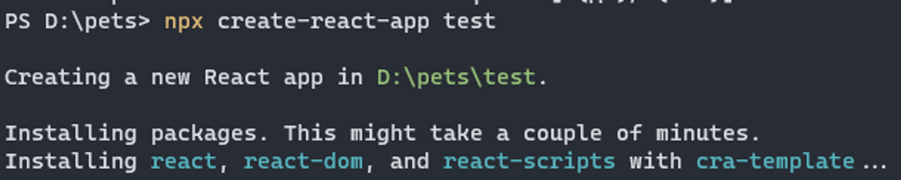
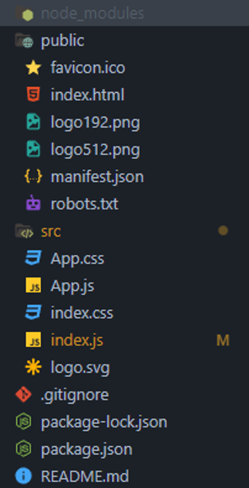
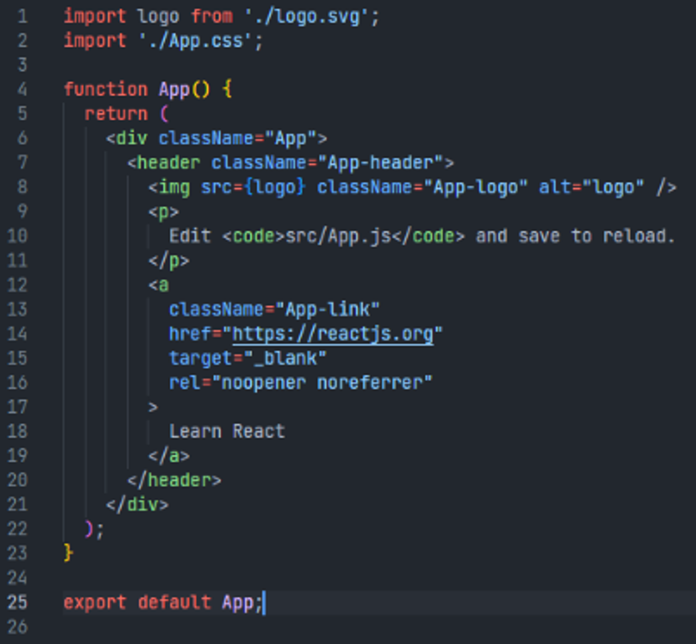
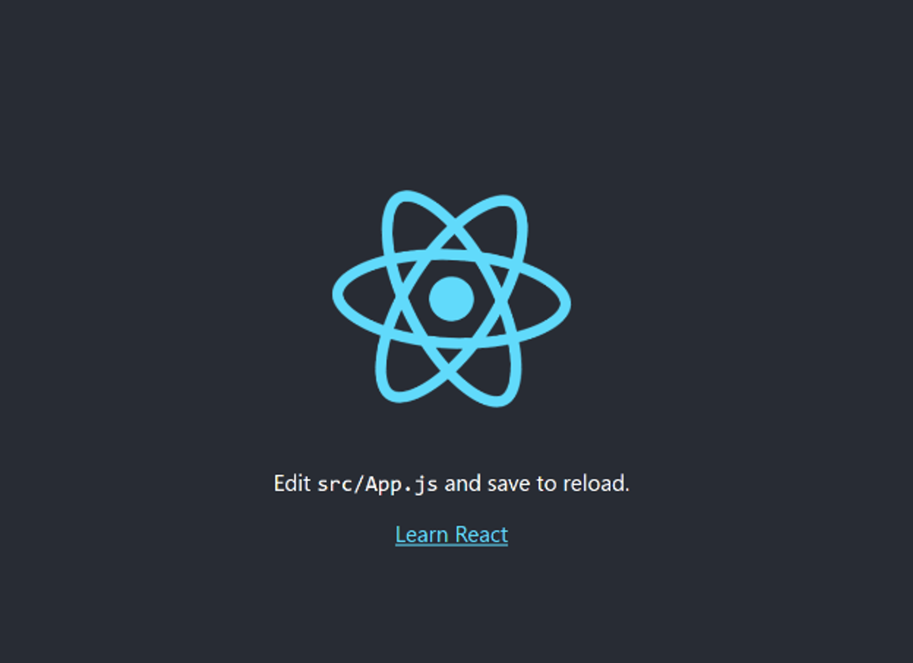
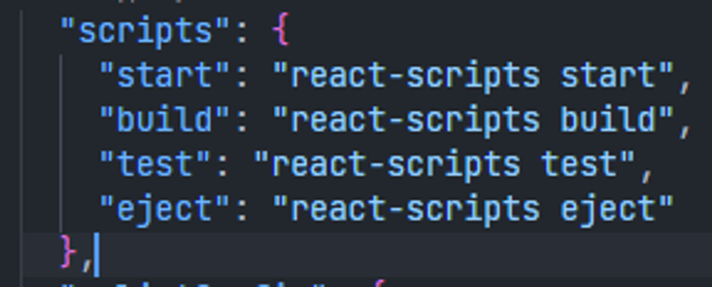
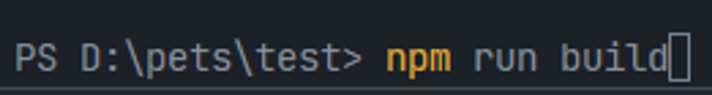
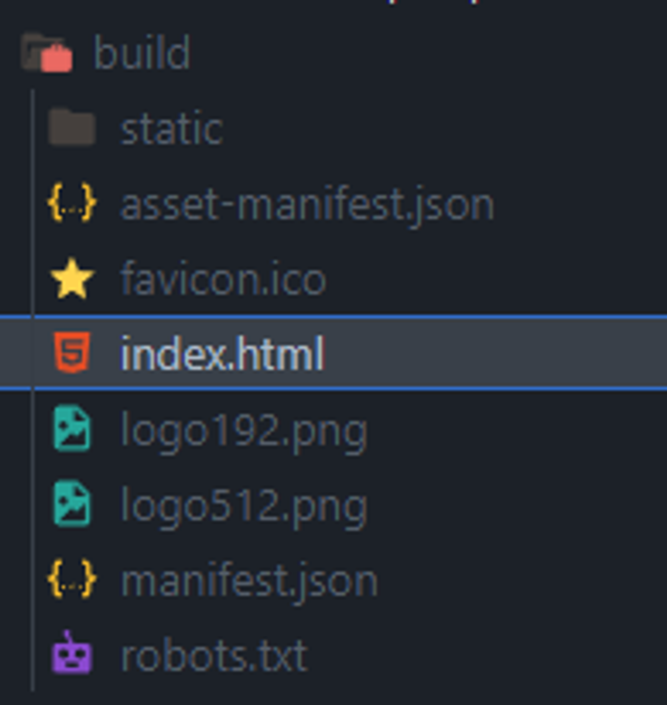
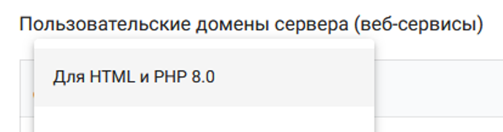
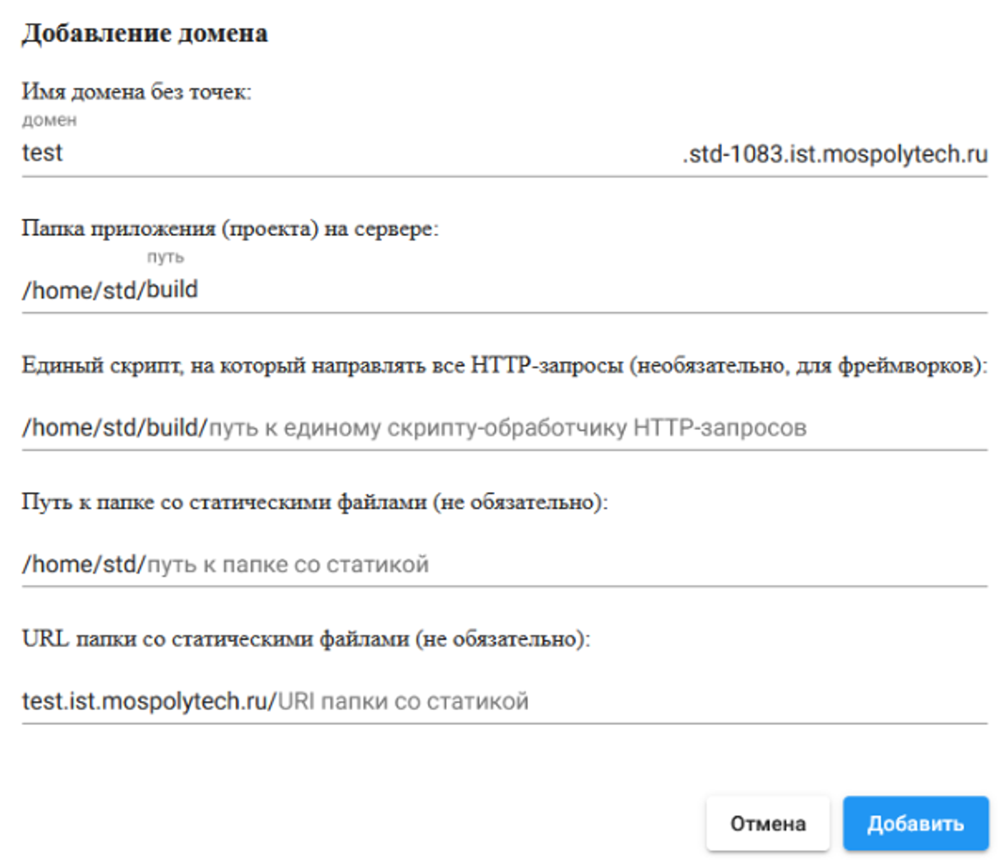
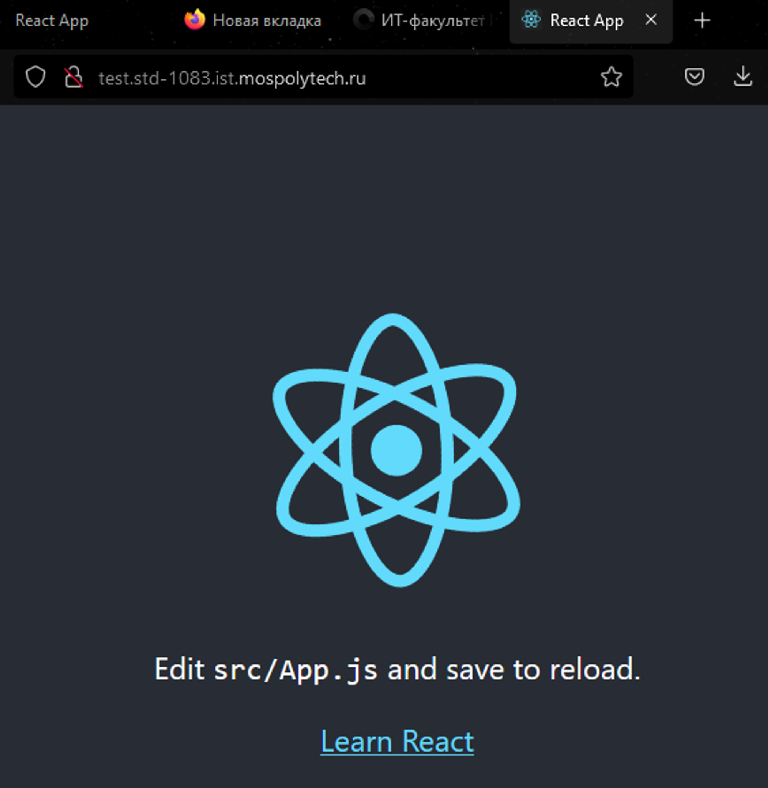

# **Введение в React**

React — JavaScript-библиотека для создания SPA (Single Page Application) веб приложений, использующая для отображения интерфейсов язык разметки JSX, эффективно преобразовывающий JavaScript код в HTML элементы и манипулирующий DOM деревом.

## **Как начать работать, используя React**

Для начала работы с React необходимо установить стабильную версию Node.js на ваш рабочий компьютер. После этого необходимо создать новое React приложение при помощи команды **npx create-react-app** "Название приложения". Утилита командной строки самостоятельно установит все необходимые пакеты для начала работы.

После установки в директории появится папка вашего нового проекта. Она состоит из основных директорий: 
       node_modules — папка node пакетов, public — папка для статических файлов, src — папка, в которой хранится основной код React приложения. В ней же происходит основной процесс разработки приложения.

При создании приложения создаётся базовый компонент страницы, представленный ниже. Для локального запуска приложения используется команда **npm start**.

Для того, чтобы собрать приложение и разместить его на хостинге, необходимо выполнить команду **npm run build** и дождаться окончания процесса сборки. В результате будет сгенерирована папка build, в которой будут содержаться все файлы, необходимые для работы приложения (все файлы из директории public, а также сгенерированные статические js файлы в папке static, уже подключённые к html странице).

После сборки приложения папку build можно переместить на сервер и создать новый домен, используя пункт «Для HTML и PHP 8.0»

Ваше React приложение размещено на хостинге fit.mospolytech и готово к работе.

## **Плюсы и минусы**

К плюсам данного веб-фреймворка можно отнести модульность, возможность использовать множество различных библиотек, если какой-то из элементов сборки не удовлетворяет вашим потребностям. Экосистема React активно развивается и предоставляет набор из инструментов для хранения состояния и обмена данными (Redux, MobX, XState и т.д.), инструментов для организации маршрутизации на странице (React-Router), CSS  и CSS-in-JS библиотек (StyledCSS, Tailwind, Emotion и др.), а также сотен библиотек готовых компонентов для ускорения разработки.

К минусам стоит отнести отсутствие единой модульной базы, в связи с чем стек технологий может значительно отличаться от проекта к проекту. Отсутствие строгих требований к организации директорий может привести к затруднениям в разработке больших приложений, состоящих из десятков страниц и сотен компонентов. React также предлагает разные 
концептуально методы построения компонентов (классы и функции), что может        затруднить понимание кода в незнакомой методологии.