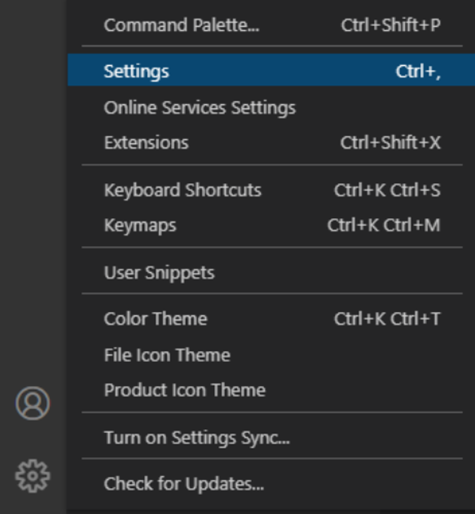
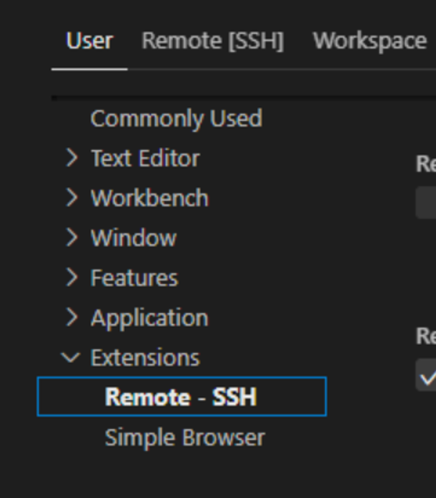
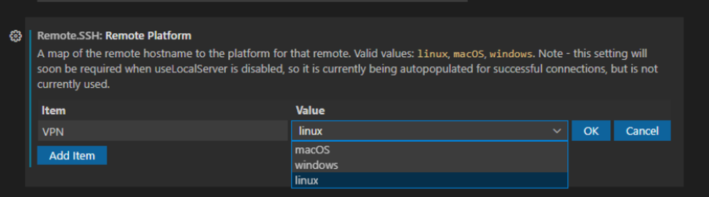

# **Выбор ОС в настройках Visual Code**

В случаях когда при подключении через OpenVPN проходит пинг на std-001.ist.mospolytech.ru, но подключение не устанавливается.

1. Открыть настройки Visual Code

2. Перейти во вкладку Расширения -> Remote SSH

 

3. Убедиться что Ваше соединение настроено на значение linux

