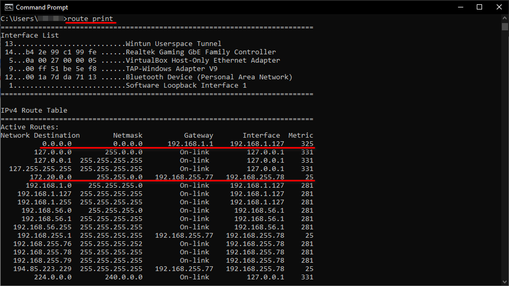
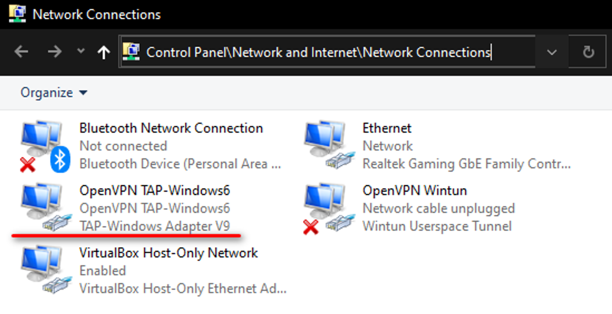
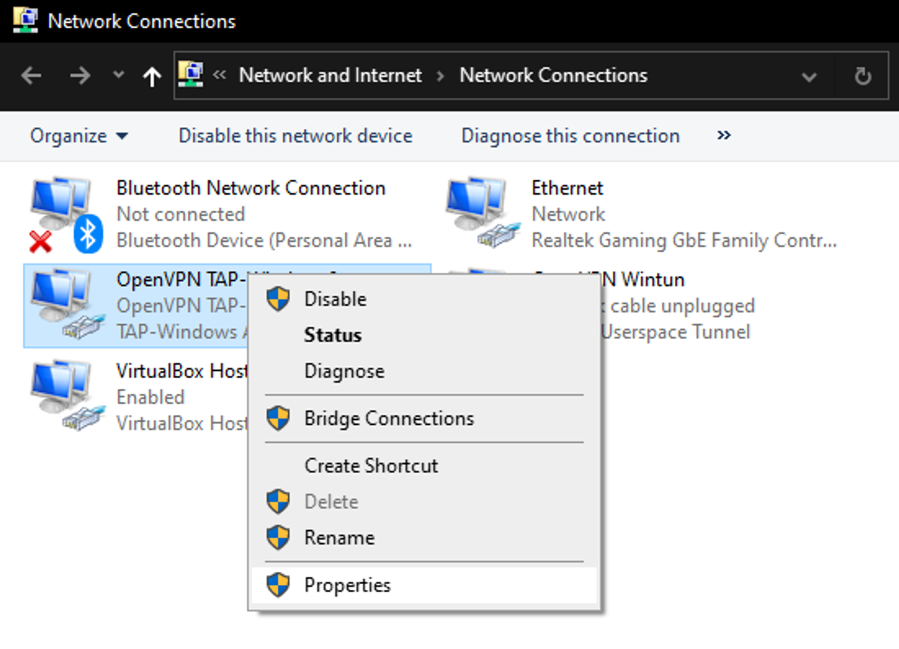
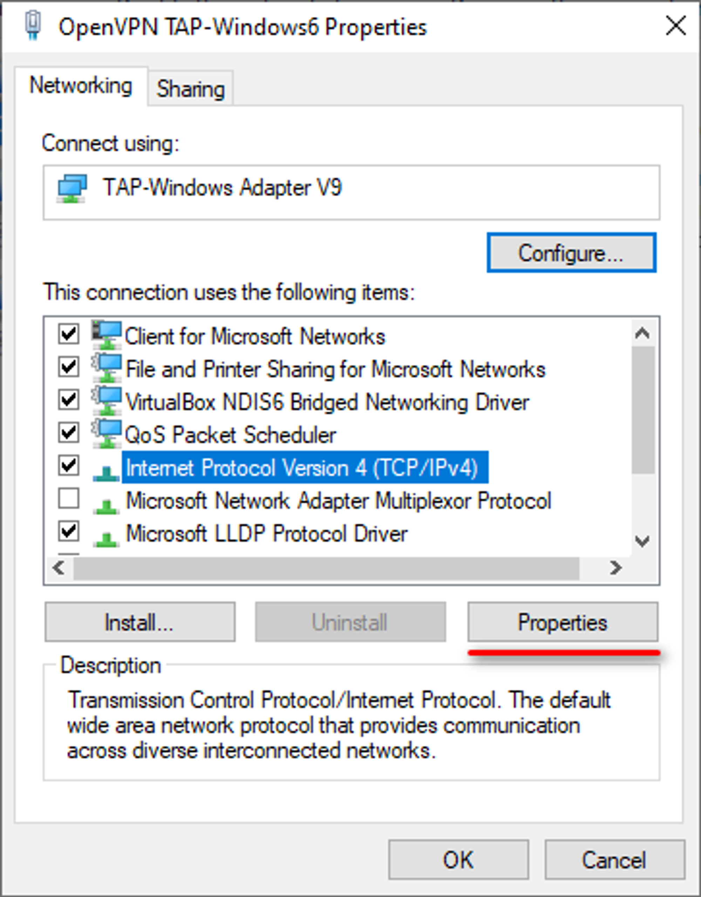
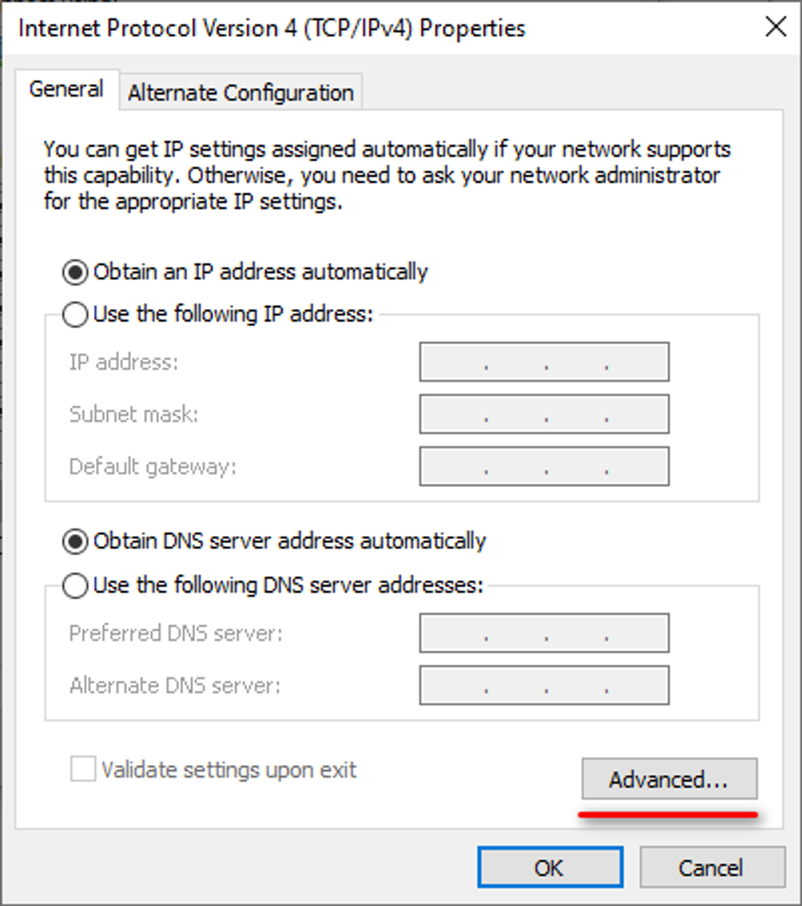
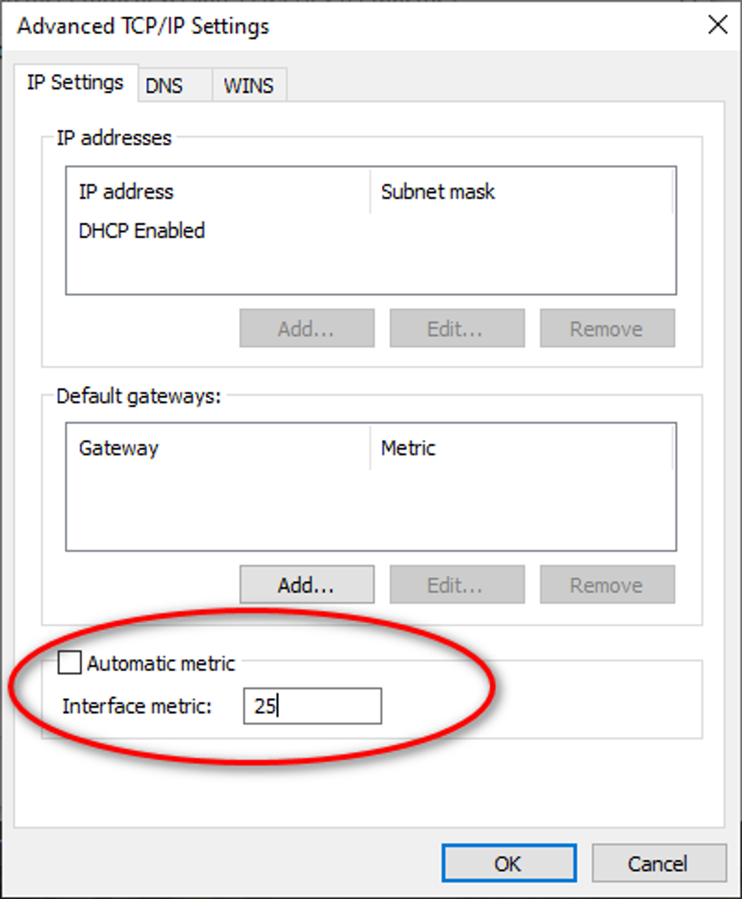

# **Изменение приоритета сетевого адаптера в Windows 10**

Может помочь в случаях когда соединение OpenVPN устанавливается, но не работает (ping std-001.ist.mospolytech.ru возвращает ошибку).

Первым делом необходимо проверить приоритеты сетевого адаптера командой **route print**:

Необходимо добиться того, чтобы метрика у соединения OpenVPN (172.20.0.0) была меньше чем у 0.0.0.0.

Для этого нужно открыть в панели управления пункт Сетевые подключения:

Далее у адаптера отвечающего за подключение OpenVPN открыть свойства:

Выбрать свойства интернет протокола IPv4:

Открыть расширенные настройки:

Выставить метрику вручную:

После чего необходимо переподключиться к OpenVPN, предварительно закрыв окна со свойствами адаптера OpenVPN.