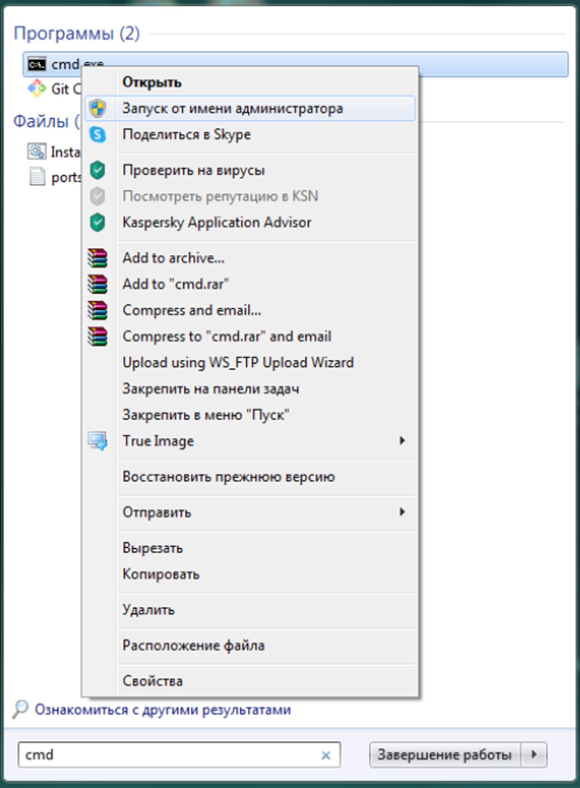
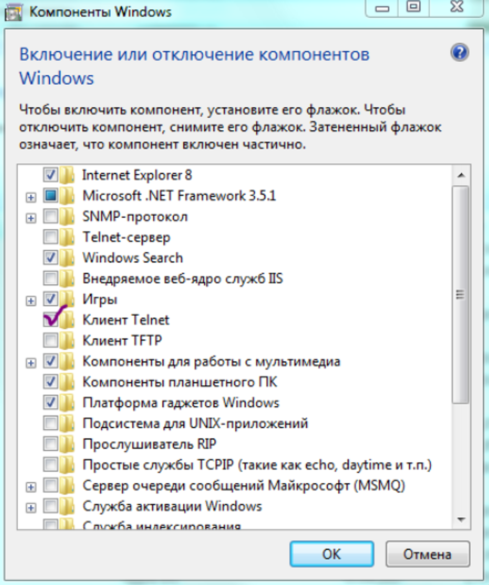

# ****Не работает ssh/telnet в Windows****

Дело в том, что такая ошибка часто стала возникать, в особенности в версиях Windows старше XP.  

Ошибкой эту ситуацию назвать можно лишь с натяжкой. Дело в том, что данные утилиты просто перестали устанавливать по умолчанию в ОС ради безопасности.

Для решения данной проблемой существует 3 способа:
        - Установить необходимые пакеты через командную строку
        - Добавить через «Программы и компоненты»
        - Использовать WSL

1. Установить необходимые пакеты через командную строку

**Windows 7**

Для этого шага, во-первых следует запустить командную строку с правами администраторами

Далее вбиваем в командной строке следующую команду:**dism /online /Enable-Feature /FeatureName:TelnetClient** и дожидаемся конца работы команды

**Windows 10**

В Windows 10 немного иначе, зато можно спокойнее работать с ssh. Откроем PowerShell через администратора и введем следующую команду для проверки установленного клиента OpenSSH (State: Installed):**Get-WindowsCapability -Online | ? Name -like 'OpenSSH.Client*'**

Если он не установлен (State: Not Present), воспользуемся командой:**Add-WindowsCapability -Online -Name OpenSSH.Client***

1. Добавить через «Программы и компоненты»

**Windows 7**

Для этого способа всё куда проще. Переходим следующим путем: Пуск → Панель управления → Программы → Программы и компоненты. 
         После чего выбираем «Включение или отключение компонентов Windows»

Для включения telnet стоит просто поставить галочку:

**Windows 10**

Идем через: Параметры → Приложения → Дополнительные возможности
 → Добавить компонент. Находим в списке «Клиент OpenSSH» и нажимаем 
кнопку «Установить»

1. Использовать WSL

**Windows 10**

Если два предыдущих способа не сработали, то пригодиться 
следующий вариант. Для этого понадобиться WSL - это специальный 
компонент системы Windows, 
         который представляет собой программный интерфейс (слой) для 
запуска Linux приложений внутри Windows 10. Вот перечень некоторых из 
них:

Рисунок 4