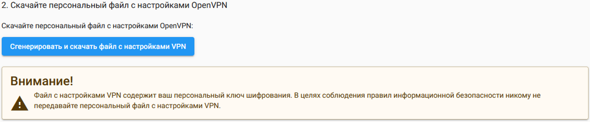
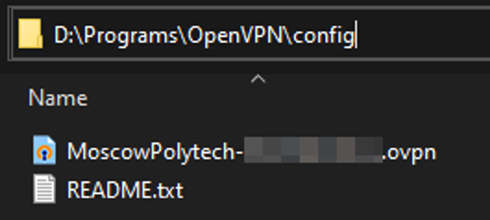
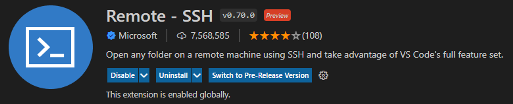
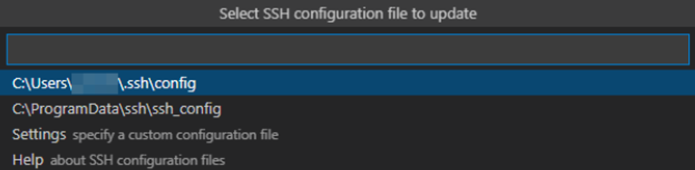
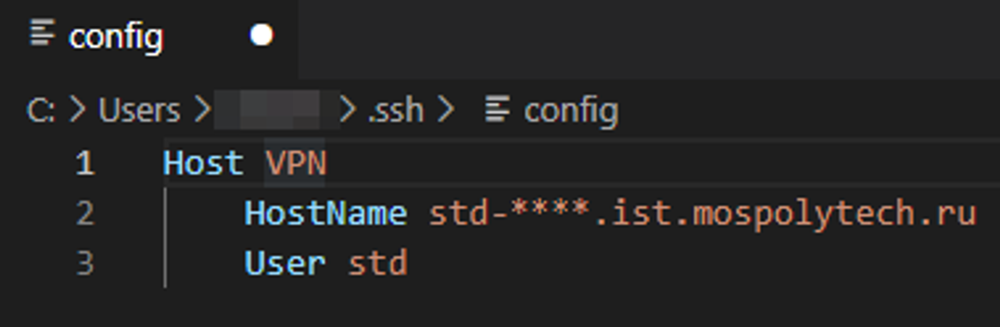
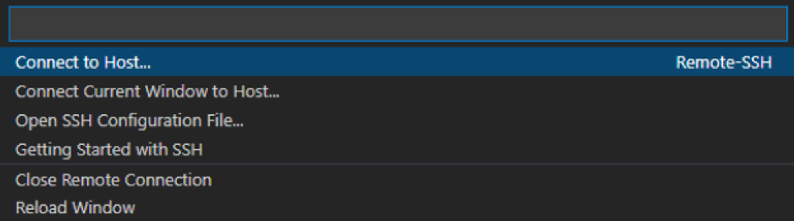
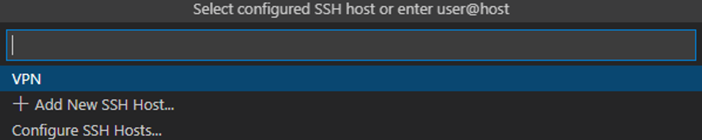

# **Подключение к хостингу с помощью Visual Studio Code**

Для подключения к хостингу через VS Code требуется настроить конфигурационный файл и запустить OpenVpn от администратора, в котором вы будете подключаться, используя свой конфигурационный файл, который можно скачать в личном кабинете - [https://fit.mospolytech.ru/systems/vpn](https://fit.mospolytech.ru/systems/vpn):

Конфигурационный файл необходимо поместить либо в папку куда был установлен OpenVpn в директорию config:

Либо в папку расположенную по следующему пути:

Также требуется установить расширение в VS Code под названием Remote - SSH. Выглядит оно так:

Далее, для изменения конфигурационного файла требуется нажать на кнопку находящуюся слева внизу экрана, выглядит она так:

Затем в появившемся меню выбрать пункт Open SSH Congifuration File:

После этого в следующем меню выбрать первый пункт:

В открывшемся конфигурационном файле, необходимо дописать HostName и User (по желанию переименовать подключение в строке Host). HostName можно взять с сайта - [https://fit.mospolytech.ru/systems/servers](https://fit.mospolytech.ru/systems/servers), в строке «SSH/SFTP для VPN», User - всегда будет std:

После чего сохраняем конфигурационный файл.

Чтобы подключиться по SSH к хостингу требуется нажать кнопку

и в появившемся меню выбрать первый пункт:

Затем в следующем меню выбрать хост, к которому хотите подключиться:

После чего в Visual Studio Code откроется новое окно с подключенным SSH. Первым делом вам потребуется ввести пароль от своего аккаунта [https://fit.mospolytech.ru](https://fit.mospolytech.ru/).

Если перед этим у вас появится меню с выбором операционной системы, используемой сервером, выбирайте Linux.