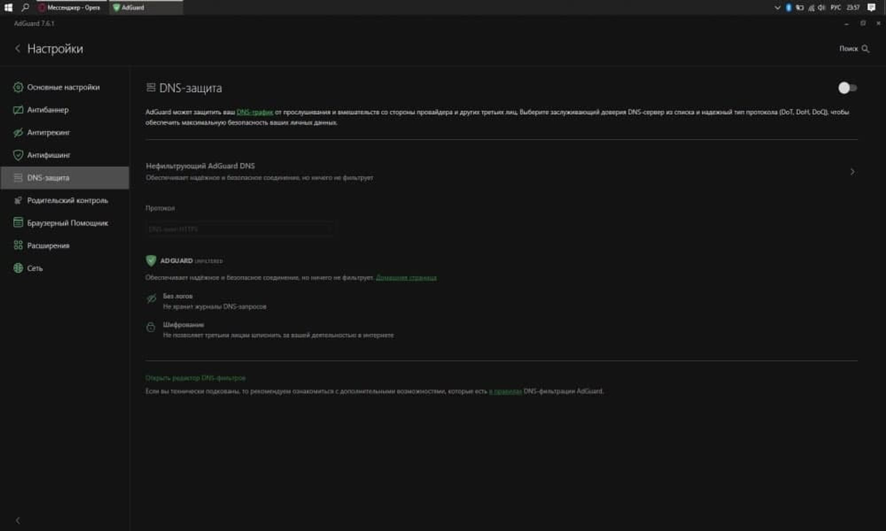
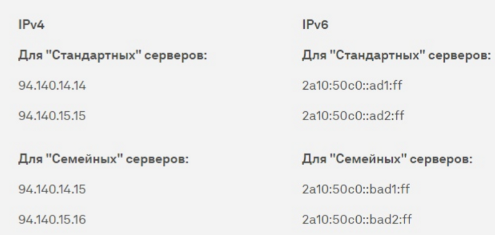

# **Проблема с DNS при подключении к SSH**

У студентов Московского Политехнического Университета, также встречалась проблема с DNS при подключении по SSH.Прошу обратить внимание на то, что данная проблема была выявлена у студентов использующих ADGuard, а именно DNS-защиты.Во-первых, стоит в ADGuard выключить DNS-защиту, как представлено на скриншоте ниже.

Далее в самой операционной системе, в примере разберем Windows, требуется открыть Панель управления через меню пуск или через поиск Windows.Перейдите в раздел Сеть и Интернет, а затем в Центр управления сетями и общим доступом.В левой стороне экрана найдите Изменение параметров адаптера и кликните по нему.Выделите ваше активное подключение, затем кликните по нему правой кнопкой мыши и выберите Свойства.Найдите в списке IP версии 4 (TCP/IP), выделите его и затем снова Свойства.Выберите Использовать следующие адреса DNS-серверов и введите данные приведенные в примере ниже:

