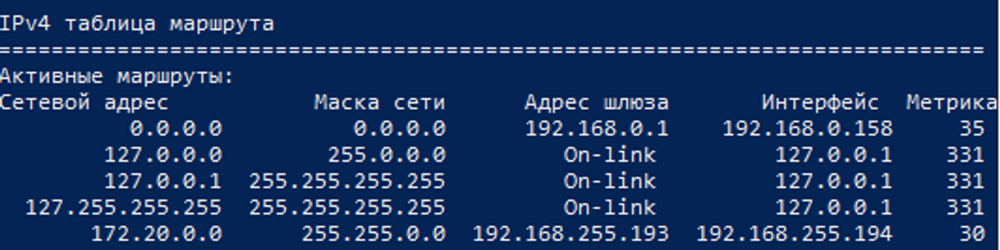

# **Возможные проблемы и способы их решения при установлении соединения по SSH**

**1. При первоначальной настройке подключения к хостингу через Visual Code, возможно выбрана неправильная ОС**

*В случаях когда при подключении через OpenVPN проходит пинг на std-001.ist.mospolytech.ru, но подключение не устанавливается.
1. Открыть настройки Visual Code

2. Перейти во вкладку Расширения -> Remote SSH

3. Убедиться что Ваше соединение настроено на значение linux

**Файл конфигурации подключения поврежден или не имеет необходимых прав**

1. Перейти в папку, где находится файл, по умолчанию он располагается в: C:\Users\Имя_пользователя\.ssh

2. Открыть настройки файла “config”

3. Убедиться что у всех пользователей стоят необходимые разрешения на работу с файлом

4. В случае необходимости пересоздать файл или добавить необходимые пункты во вкладке “Разрешения”

**Ошибки, связанные с несовпадением или неправильной генерацией SSH ключей**

Ошибка вполне может быть скрыта в неудачной генерации SSH ключей, необходимых для установления соединения.

Стоит отметить, что данный способ применим в тех случаях, когда вы получаете ошибку вида **COULD NOT ESTABLISH CONNECTION**. Все известные системе подключения хранятся рядом с уже знакомым нам файлом CONFIG по пути C:\Users\Имя_пользователя\.ssh

Мы позволим системе заново сгенерировать все необходимые ключи, для этого необходимо просто удалить или переместить файл KNOWN-HOSTS из данной папки (рекомендуем перемещать, а не удалять).

Конечно, это значит, что придётся заново подтверждать генерацию ключей при установлении соединения, но ошибка может быть решена таким способом.

**Настройка метрик соединения**

В некоторых случаях требуется дополнительная настройка сетевых интерфейсов. Чтобы убедиться, что у вас известный нам случай, запустите «Командную строку» и выполните в ней команду:route print

Примеры вывода «route print»; красными кружками помечены метрики, на которые нужно обратить внимание.

Чаще всего проблема заключается в том, что сетевой маршрут «по умолчанию» (сетевой адрес 0.0.0.0) остаётся более приоритетным, чем маршруты для VPN. Приоритет в данном случае называется метрикой. Чем метрика «меньше» (ближе к нулю), тем выше приоритет. Сравните метрики для сетевых адресов (маршрутов) 0.0.0.0 и 172.20.0.0. Если у 0.0.0.0 метрика ближе к нулю, чем у 172.20.0.0, или метрики для 0.0.0.0 и 172.20.0.0 равны, то у вас есть проблема, требующая ручного вмешательства, и она решаемая. Вам нужно для TAP-Windows Adapter (который для VPN) в настройках сети в панели управления вручную задать метрику, например, 20.

Есть несколько способов изменить метрики соединений. **Первый способ** предполагает изменение настроек соединения через GUI. Для этого переходим в панель управления, в меню Сеть и интернет/Сетевые подключения. Нас интересует интерфейс TAP-Windows-Adapter-V9.

Переходим в панель Свойства данного адаптера.

Далее находим меню IPv4 и переходим в подменю Свойства.

Переходим в меню Дополнительно и видим поле для настройки метрики. Отключаем галочку и устанавливаем собственную метрику. Учтите, что иногда к метрике добавляется 20, так что советуем поставить значение 1-10, то есть так, чтобы сумма всё равно получилась меньше вашего основного соединения.

Второй способ предполагает изменение метрик при помощи функционала командной строки PowerShell. Для этого заходим в PowerShell от имени администратора и прописываем команду route print. Далее находим наше основное подключение и подключение с адресом 172.20.0.0. Как видно в примере, метрики у этого подключения значительно больше, чем у основного.

Изменять метрики мы будем при помощи команды route change (change по той причине, что данное подключение у нас уже имеется)

Где 172.20.0.0 - сетевой адрес, 255.255.0.0 - маска, а 192.168.255.193 - адрес шлюза. При этом метрика задается при помощи пункта metric в команде.

Как мы видим, теперь метрика соединения стала равняться 30, то есть стала приоритетней основного.