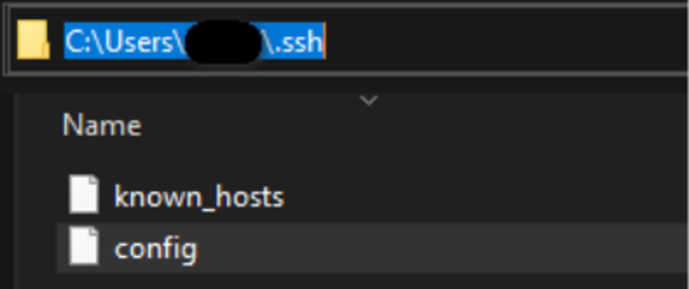
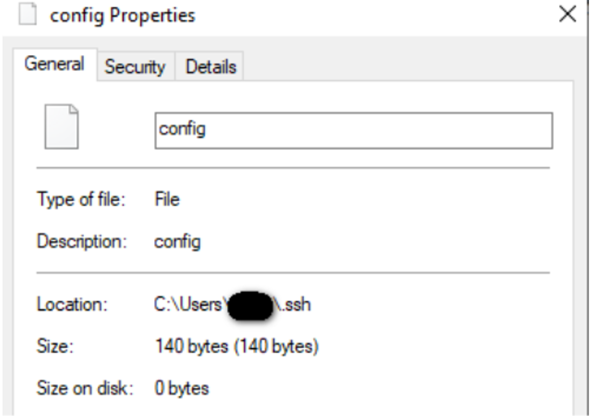
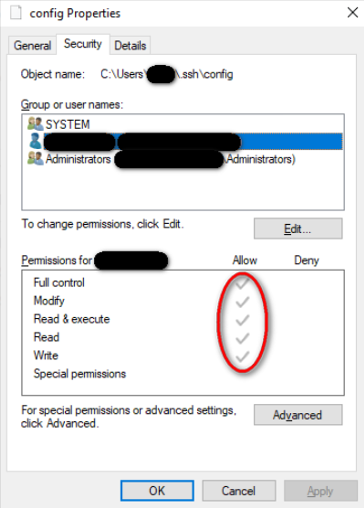

# ****Проверка файла конфигурации подключения по SSH****

1. Перейти в папку, где находится файл, по умолчанию он располагается в: **C:\Users\Имя_пользователя\.ssh**

2. Открыть настройки файла “config”

3. Убедиться что у всех пользователей стоят необходимые разрешения на работу с файлом

4. В случае необходимости пересоздать файл или добавить необходимые пункты во вкладке “Разрешения”