# **Подключение git’а к Qt Creator**

**Создание хранилища в Qt Creator**

При создании проекта требуется выбрать в качестве контроля версий: git.

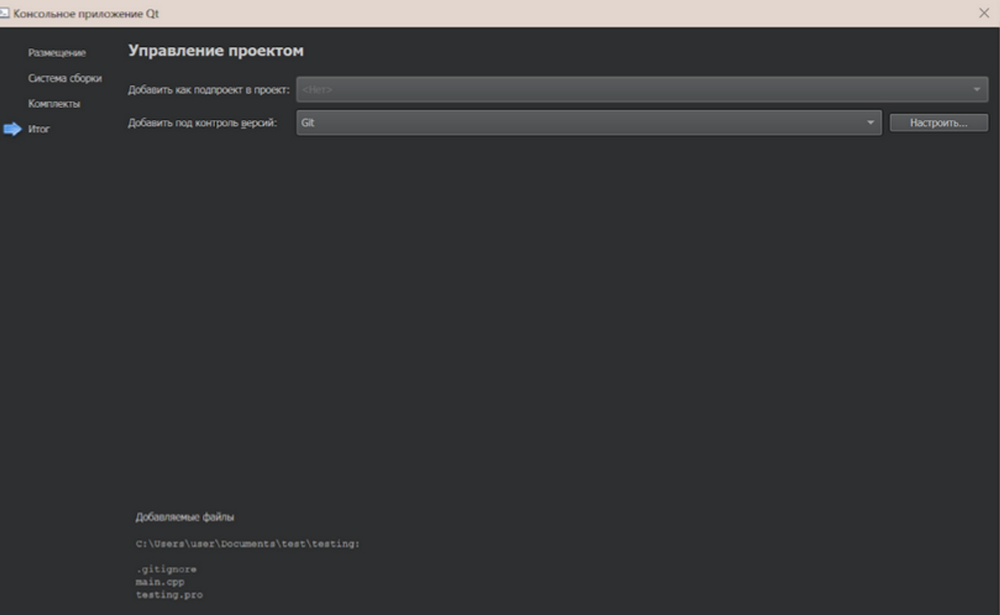
Если у вас уже был создан проект без контроля версий, то выполните следующие шаги:

1. Инструменты -> Git -> Создать хранилище

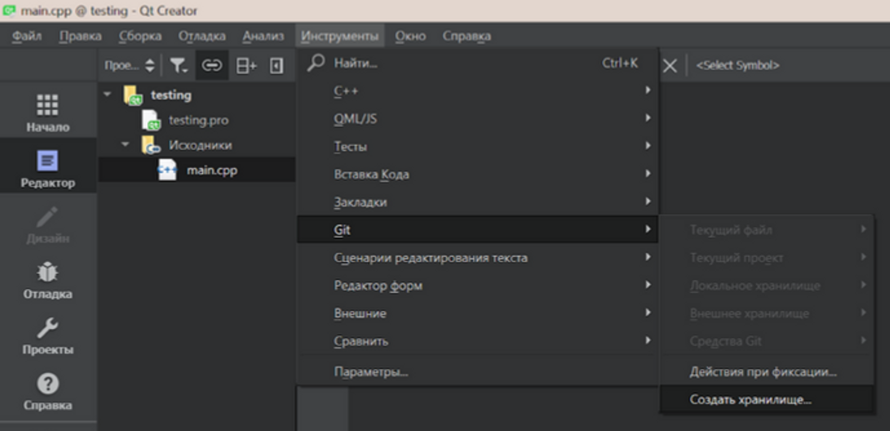

2. Вам будет предложена папка проекта по умолчанию. Выберите её.
3. Появится подтверждение об успешном создании хранилища:

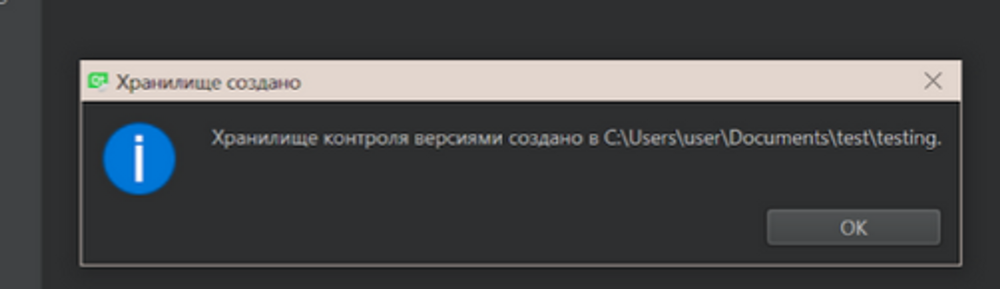

**Создание репозитория на GitLab**

Теперь создадим репозиторий на gitlab.com, например. Репозиторий может быть пустым или же содержать README.md - это не принципиально.

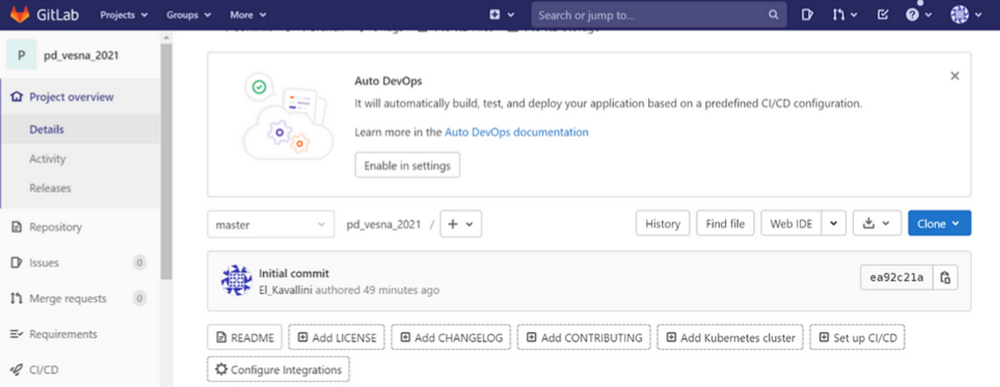

Если вы используете GitHub или BitBucket, то можете воспользоваться данной инструкцией: [https://exlmoto.ru/git-and-qt-creator/](https://exlmoto.ru/git-and-qt-creator/)

**Установка Git и работа с Git Bash**

Далее, если у вас не установлен Git, это следует сделать, после чего открываем «Git Bash» и вводим такие команды:

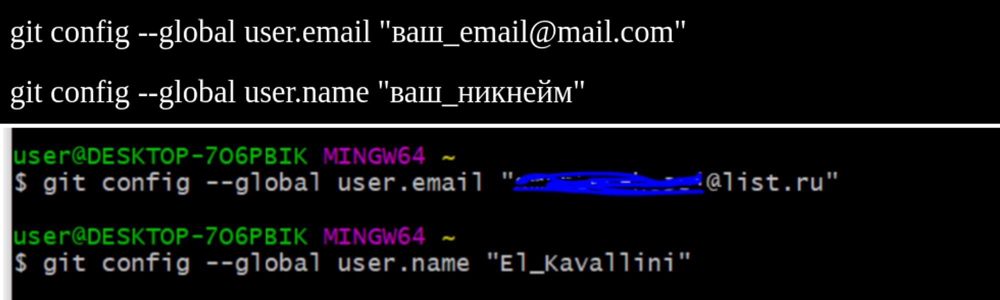

**Создание SSH-ключа**

Один из важных этапов настройки является создание ssh-ключа.Для этого вводим в «Git Bash» следующую команду:

Если папка «.ssh» уже существует, сохраните резервную копию её содержимого следующей командой:

Если такой папки нет, выполняем генерацию SSH-ключа командой:

На все вопросы, возникающие при выполнении этой команды, необходимо просто нажимать «Enter».После того, как мы сгенерировали наш уникальный SSH-ключ, скопируем его в буфер обмена командой:

Ниже приведён ход выполнения данных команд. Стоит отметить, что если вам понадобятся файлы с ключами позже, вы сможете найти их по указанному командой пути.

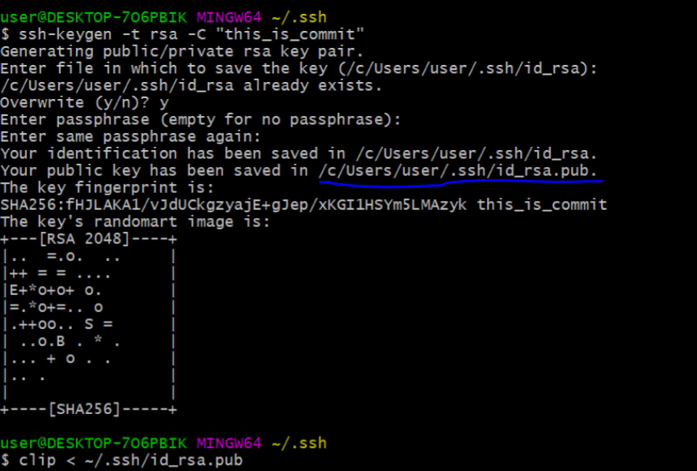

**Добавление SSH-ключа в аккаунт удаленного репозитория**

Следующим этапом будет - добавление ssh-ключа в наш аккаунт gitlab. Для этого в меню аккаунта выбираем «Edit profile», а далее в левом боковом меню «SSH Keys».

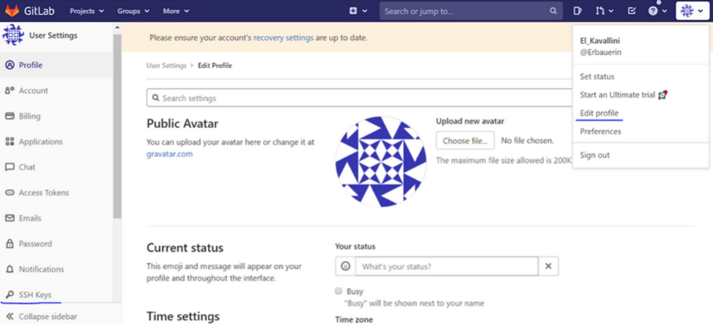

Теперь в соответствующее поле вставляем скопированный (при помощи команды clip < ~/.ssh/id_rsa.pub) ключ из буфера обмена:

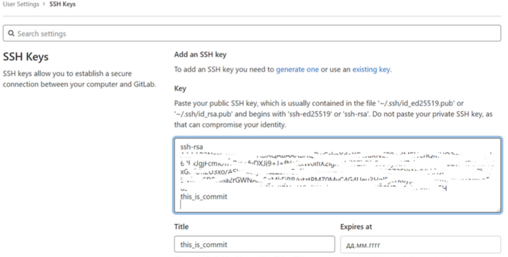

Нажимаем кнопку «Add key» для добавления ssh-ключа.

**Настройка связи локального и удаленного репозиториев**

Осталось лишь связать наш проект с удаленным репозиторием. Для этого требуется для начала создать локальный репозиторий. Запускаем «Git Bash» и переходим в директорию с исходным кодом проекта:

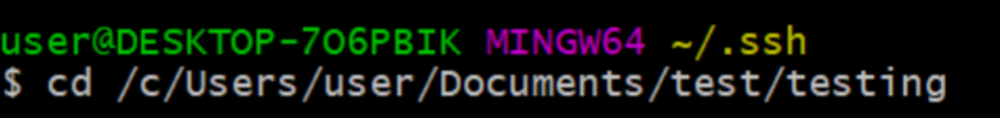

Заметьте, что в «Git Bash» диск C:// пишется как /c/, аналогичное будет происходить и с остальными дисками. Далее стандартная процедура инициализации локального репозитория:

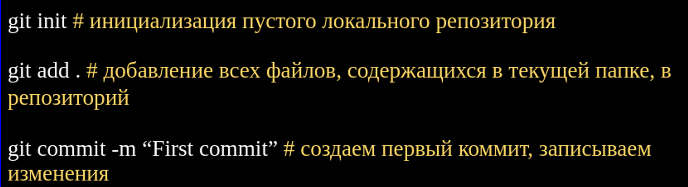

**Важно!** Для работы в Qt Creator требуется указать именно SSH-доступ в команде «git remote add origin», SSH-ссылку на ваш проект можно получить здесь:

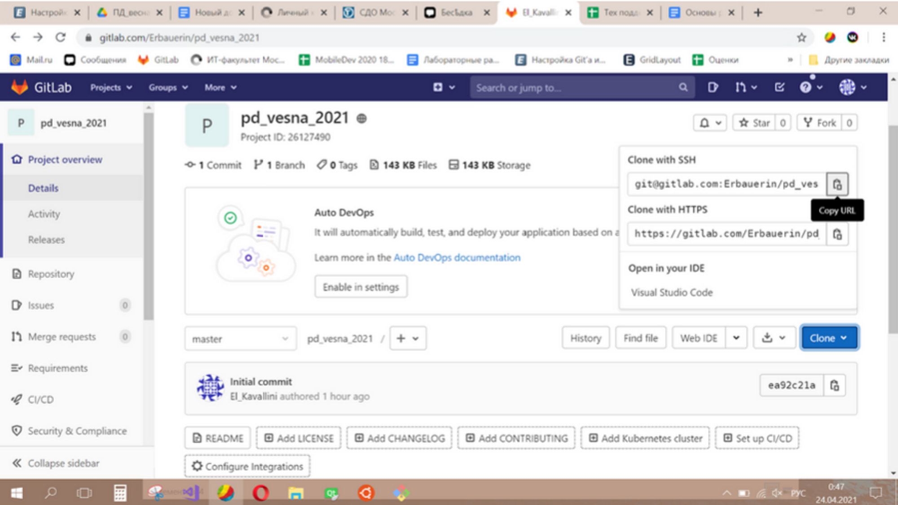

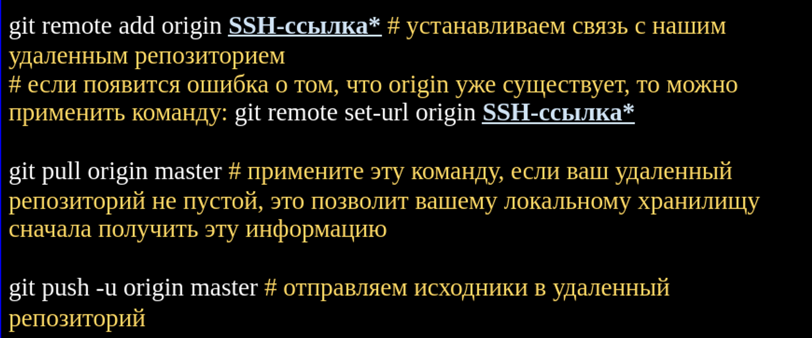

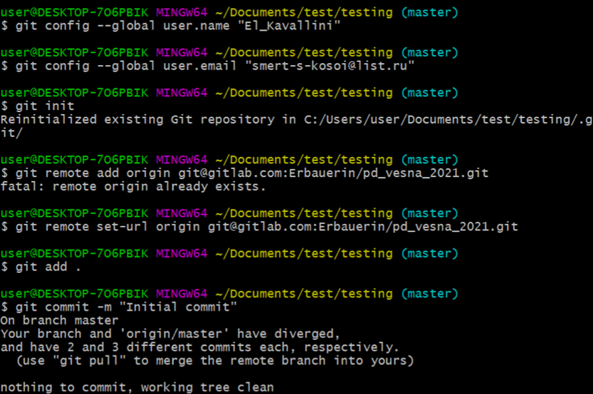

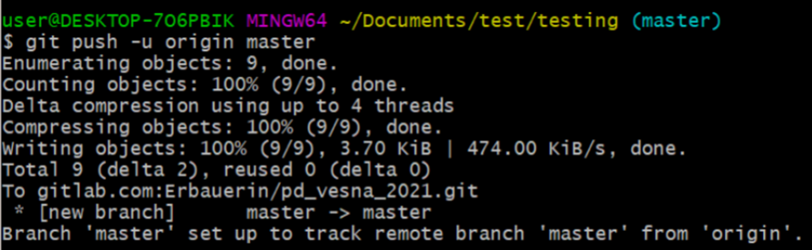

Таким образом, мы успешно отправили файлы в удаленный репозиторий:

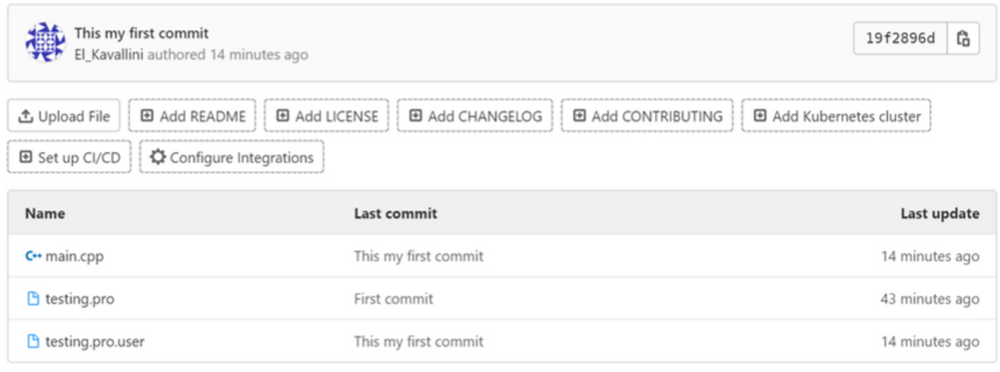

**Конечная настройка Qt Creator’а и работа с Git’ом в нём**

Возвращаемся в Qt Creator.Переходим по пути:Инструменты -> Параметры -> Контроль версий -> GitЗдесь должен быть прописан путь до исполняемого файла git.exe и проставлена галочка напротив среды HOME.

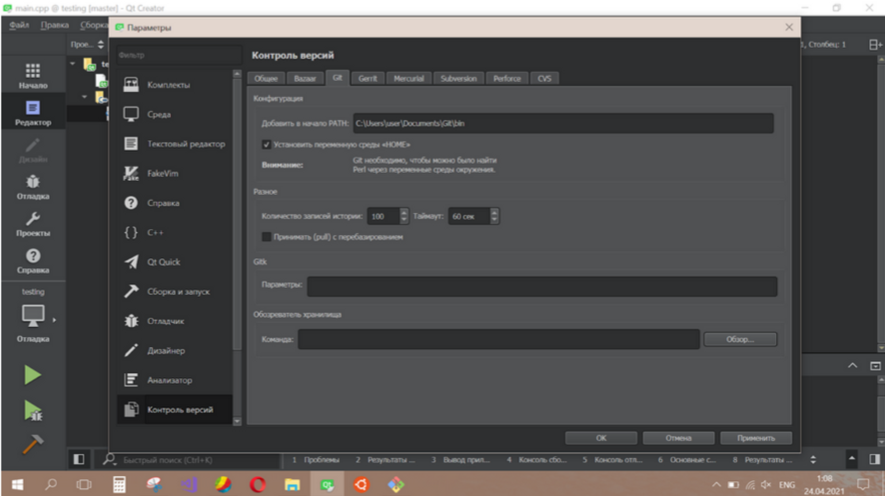

После этого следует перезапустить Qt Creator.Чтобы зафиксировать изменения в файлах вашего проекта требуется выбрать:Инструменты -> Git -> Локальное хранилище -> Фиксировать

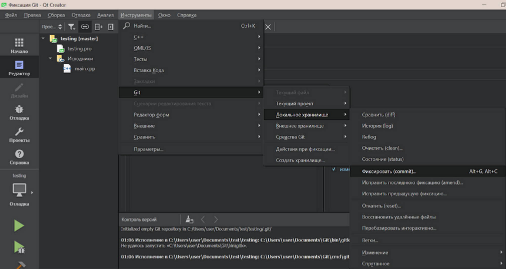

Выбираем нужные файлы, прописываем комментарий и нажимаем кнопку «Фиксировать»:

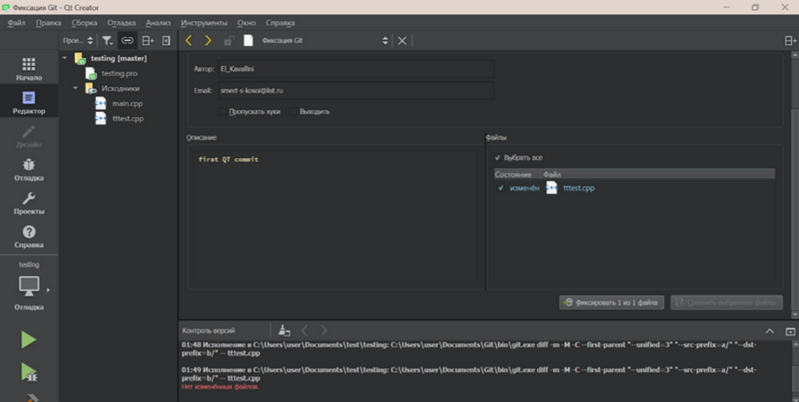

По итогу получим уведомление об успешном фиксировании:

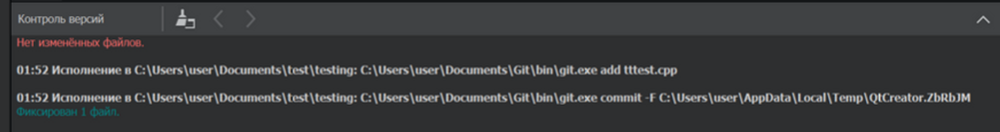

Для отправки закоммиченных изменений на удаленный репозиторий выбираем:Инструменты -> Git -> Внешнее хранилище -> Отправить

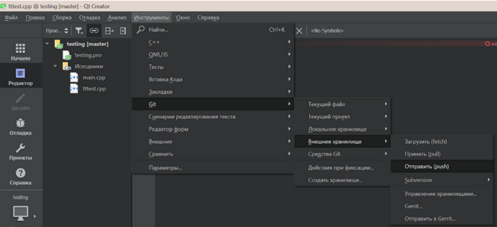

И вот очередное уведомление об успешной отправке:

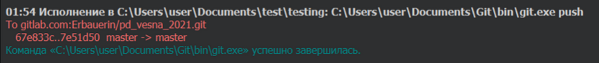

А вот и наш комментарий на gitlab:

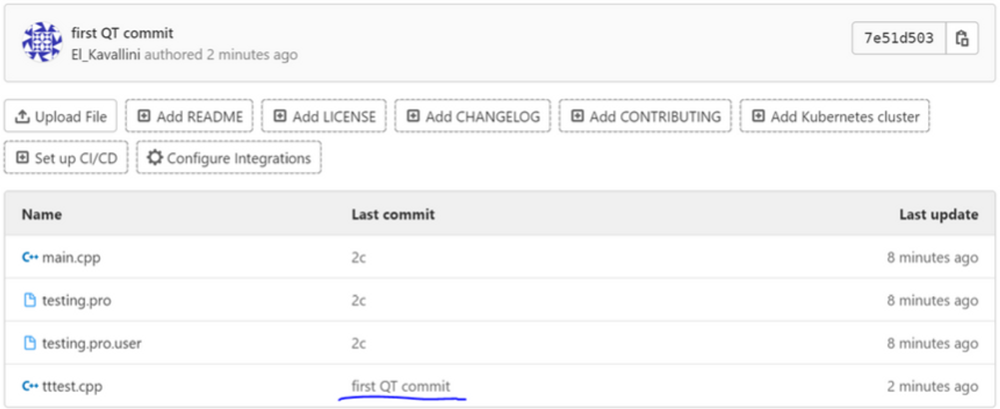

Теперь вы сможете комментировать и отправлять изменения своего проекта всего двумя кликами!