# ****Работа с Git****

В данном руководстве будут расписаны основные команды для работы с платформой Git, все операции будут проводиться локально (при этом, данные команды будут также актуальны и для работы с удаленным сервером).

1. Создание репозитория в Github

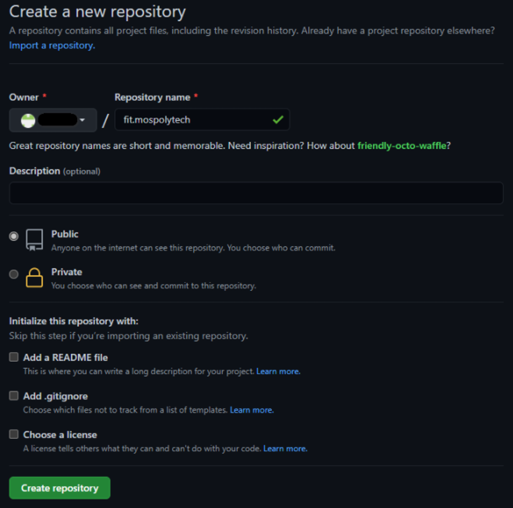

2. После создания репозитория, его необходимо привязать к папке

Открываем командную строку для работы

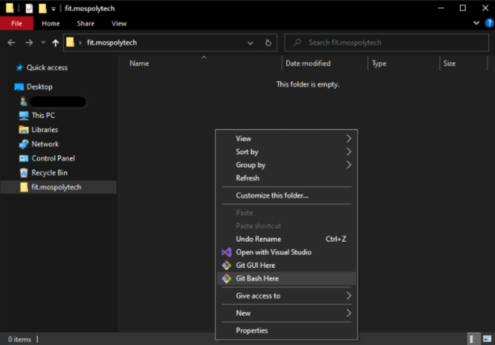

Копируем ссылку на наш репозиторий

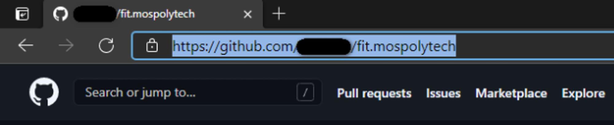

Инициализируем Git

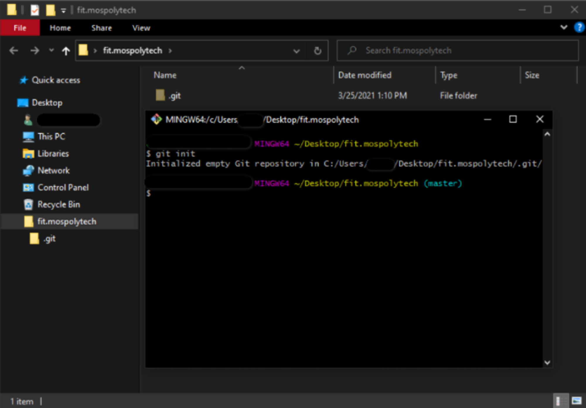

Привязываем репозиторий к папке (в конце ссылки необходимо добавить .git)

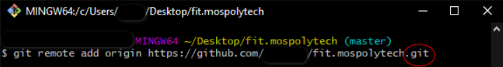

Загрузка файлов

3. После создания репозитория, его необходимо привязать к папке

Создадим тестовый файл и попробуем загрузить его в основную ветку (master) нашего репозитория

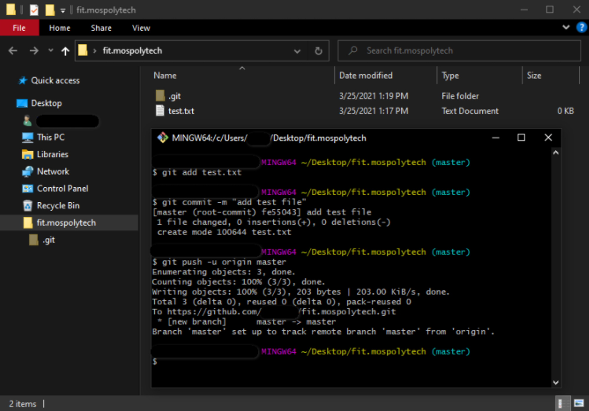

Команда **git add** - позволяет нам добавлять файлы, в данном примере мы добавляли один файл “test.txt”, в случае когда нам необходимо добавить в гит всё содержимое папки, а не только один файл, необходимо писать: **git add .**
Команда **git commit -m “add test file”** - добавление коммита к нашим файлам, в скобках мы указываем описание нашего коммитаКоманда **git push -u origin master** - загрузка всех закомиченных файлов на сайт, в случае если файлы необходимо загрузить на другую ветку, команда будет выглядеть следующий образом: **git push -u origin имя_ветки**

Результат

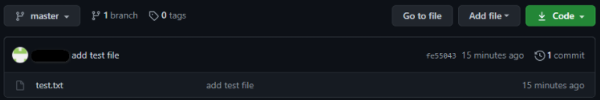

4. Удаление файлов

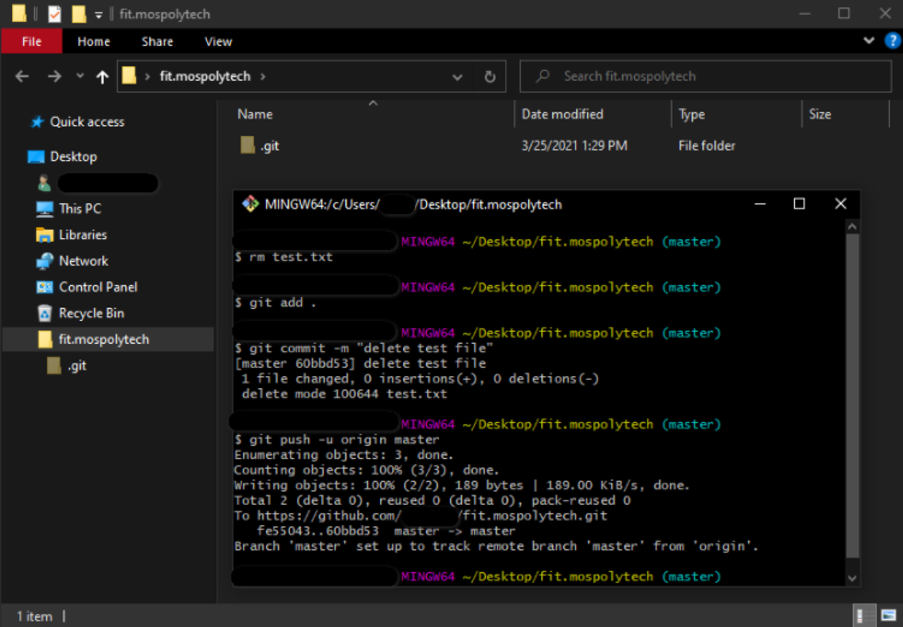

Команда **rm test.txt** - удаление выбранного файла
Далее по аналогии с добавлением файлов, нам необходимо закоммитить изменения и отослать всё на сайт

Результат

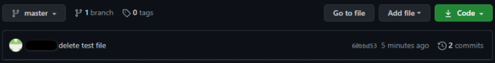

5. Возврат к коммиту (восстановление файлов)

Переходим во вкладку с нашими коммитами

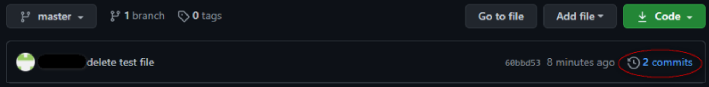

Копируем id интересующего нас коммита

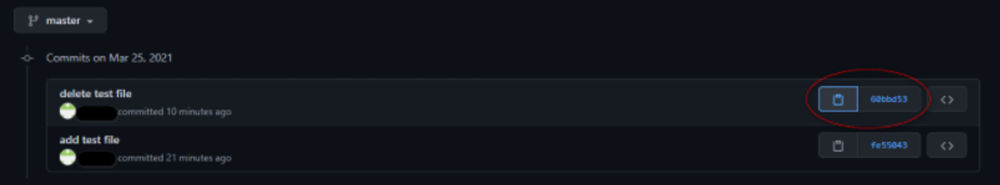

Вводим команду и вставляем скопированный id коммита

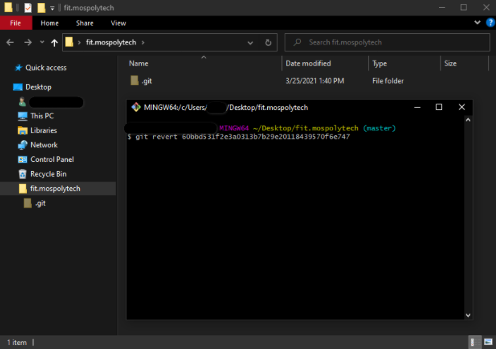

В открывшемся окне нажимаем сочетание клавиш **shift + ж**, вводим **wq** и жмём Enter

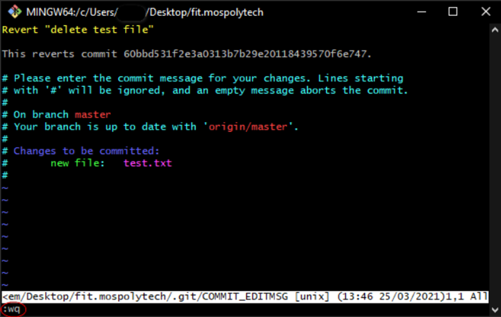

Результат

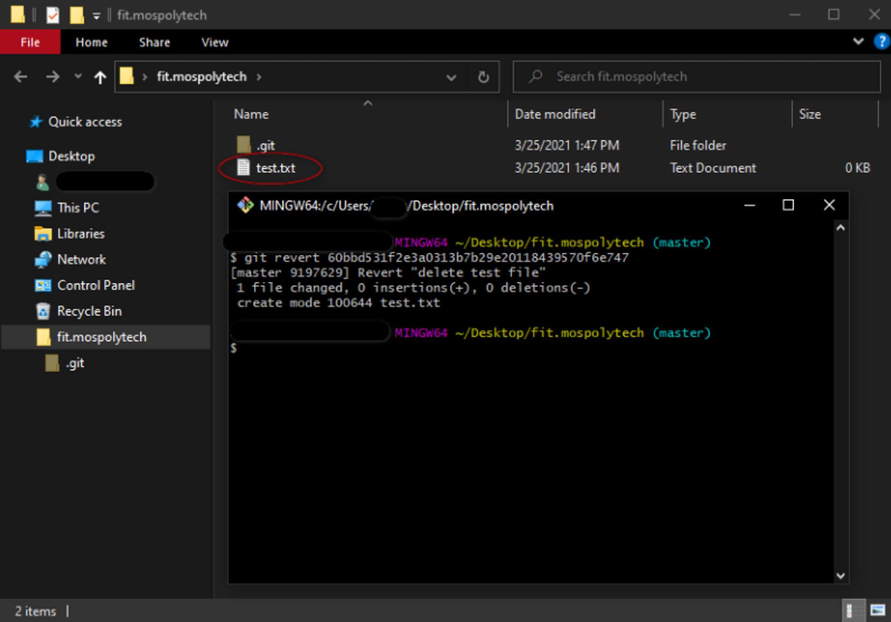