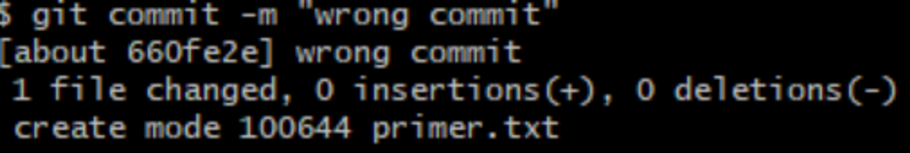
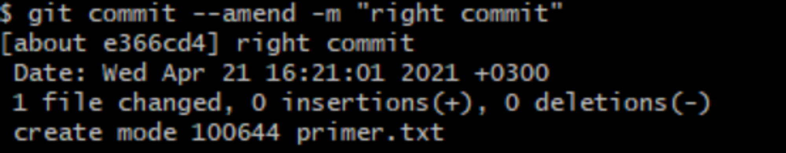
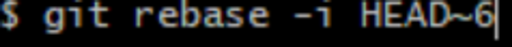
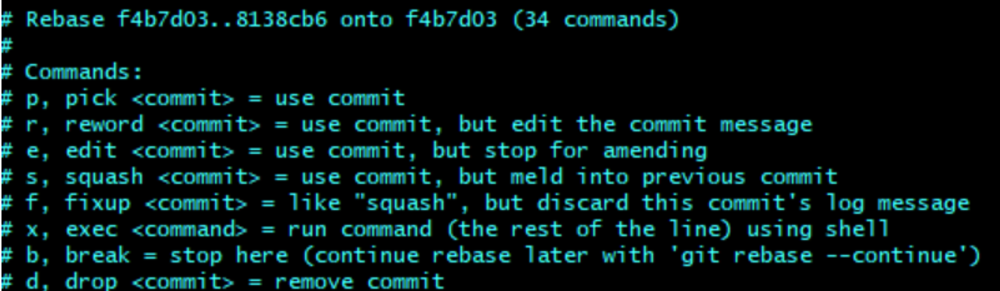
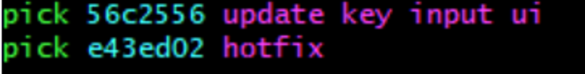

# **Работа с commit’ами**

Допустим, мы допустили ошибку при написании последнего commit’а и хотим его изменить.

Для этого нам понадобится команда **git commit –amend –m “правильный commit**”. Пример данной команды представлен ниже.

Для более детальной работы с commit’ами на понадобится команда **git rebase –i**.

Далее у нас появятся наши commit’ы в списке, а ниже будет схема с командами.

Все эти команды мы будем писать вместо слова pick в нашем списке commit’ов, как на примере ниже:

Поподробнее разберемся с самими командами:

**Pick** – означает, что мы уже используем этот commit.

**Reword** – мы используем уже сделанный commit, но переименовываем его.

**Edit** – изменение commit’а. Это означает, что когда git дойдет до нашего commit’а, git предложит выполнить какие либо изменения.

**Squash** – означает, что наш commit будет объединен с предыдущим commit’ом.

**Fixup** – тоже самое что и Squash, только нам не будет предложено изменение имя commit’а.

**Exec** – выполнение скрипта для указанного commit’а. Сам же скрипт дописывается в конце строки и применяется для каждого файла в commit’е.

**Drop** – удаление commit’а.