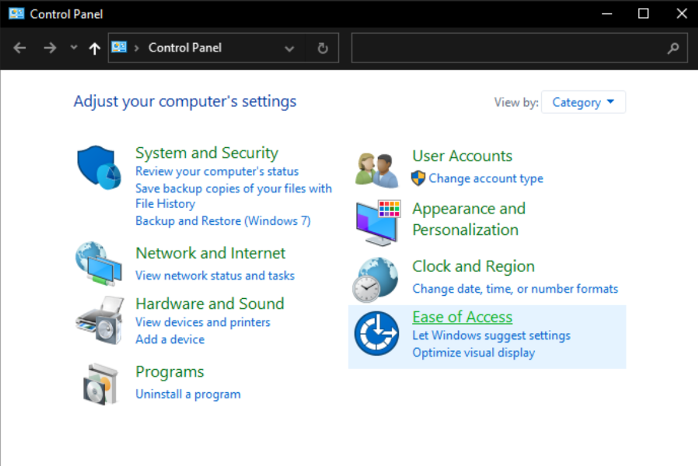
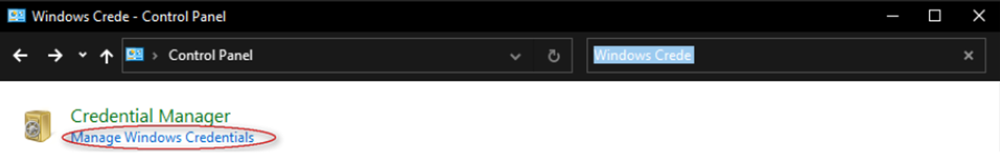
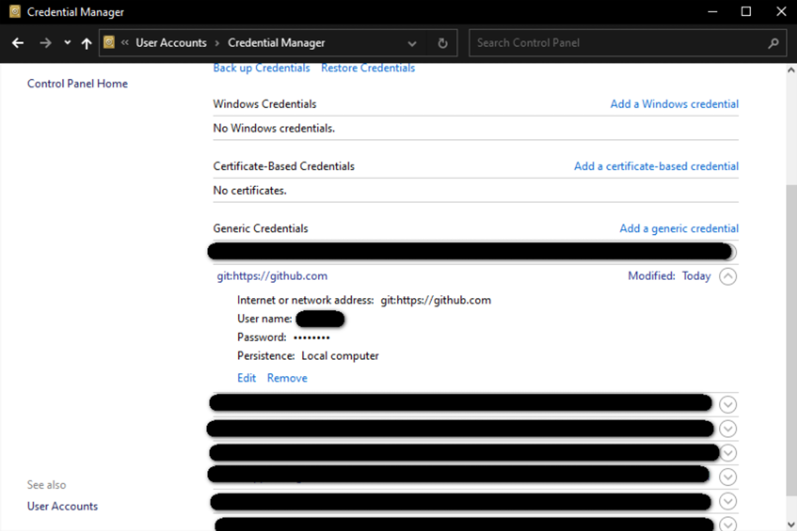
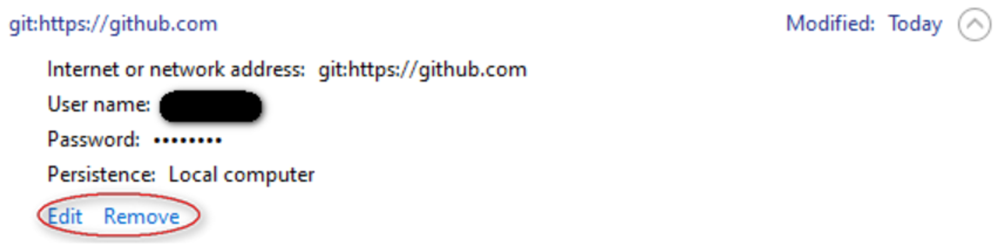

# Удаление или изменение учетной записи Git на локальном компьютере

1. Открываем “Панель управления”

2. В поиске ищем “Учетные данные Windows”

3. Находим github.com или gitlab.com

4. Производим удаление или изменение данных учетной записи

